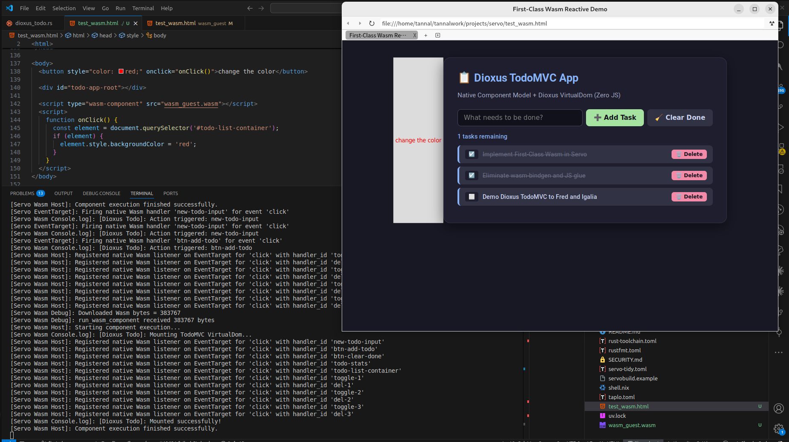

# Quick Start

## Build

```bash
# 1. Install Rust target for WebAssembly
rustup target add wasm32-unknown-unknown

# 2. Install cargo-component (Bytecode Alliance Component Model build tool)
cargo install cargo-component --locked

# 3. (Optional) Install wasm-tools for inspecting component interfaces
cargo install wasm-tools --locked
```


From the `wasm_guest/` directory:

```
cargo component build --release --target wasm32-unknown-unknown

# Copy the built artifact to the same location of your html
cp target/wasm32-unknown-unknown/release/wasm_guest.wasm ../wasm_guest.wasm
```

## Running in Servo

The browser loads the WebAssembly binary directly as a first-class script element without any JavaScript wrapper:

```html
<!DOCTYPE html>
<html>
  <head>
    <meta charset="utf-8">
    <title>First-Class Wasm Reactive Demo</title>
  </head>
  <body>
    <!-- Container where the Wasm Component mounts its VirtualDOM -->
    <div id="todo-app-root"></div>

    <!-- Native Wasm Component loading (No JS glue!) -->
    <script type="wasm-component" src="wasm_guest.wasm"></script>
  </body>
</html>
```

```bash
./mach build
```

```bash
./mach run test_wasm.html
```

For the todo app using dixous:



## Switching the examples

Modify `src/lib.rs`

Let's say you want to build dioxus_mathml_playground:

```rust
impl Guest for Component {
    fn run() {
        dioxus_mathml_playground::run();
    }

    fn on_event(handler_id: String, event_type: String) {
        dioxus_mathml_playground::on_event(&handler_id);
    }
}
```

Change to method to dioxus_mathml_playground::on_event and dioxus_mathml_playground::run.


Then build again

```
cargo component build --release --target wasm32-unknown-unknown
```
